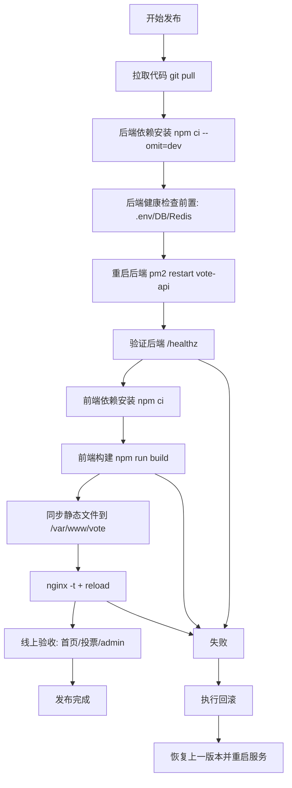

# 代码更新流程示意（生产环境）

本文用于保证每次更新都能稳定发布，重点目标：

- 用户端（含微信）持续可访问
- 后台配置变更可即时生效
- 任何失败步骤都可快速回滚

## 1. 标准发布流程图



## 2. 一次发布的完整命令

按顺序执行：

```bash
cd /home/deploy/Vote
git pull

cd /home/deploy/Vote/backend
npm ci --omit=dev
npm run init-db    # 若有新表或新字段（如 student_id）更新，可自动尝试创建
pm2 restart vote-api
curl http://127.0.0.1:8080/healthz

cd /home/deploy/Vote
npm ci
npm run build
sudo rsync -av --delete /home/deploy/Vote/dist/ /var/www/vote/

sudo nginx -t
sudo systemctl reload nginx
```

## 3. 发布后最小验收清单

- 打开首页可以正常加载候选人
- 手机微信打开同一地址可正常提交投票
- 打开 /admin 可切换“快速开始投票/快速停止投票”并立即生效
- 访问 /api/v1/votes/results 返回 200 且数据正常
- 访问 /healthz 返回 200

## 4. 回滚建议

建议在每次发布前打 Git 标签并保留上一版 dist：

```bash
cd /home/deploy/Vote
git tag release-$(date +%Y%m%d-%H%M)
```

若发布失败：

1. 回退到上一个稳定 commit。
2. 重新执行前端构建与 rsync。
3. 重启 pm2 和 reload nginx。
4. 重新跑“最小验收清单”。

## 5. 关键注意事项

- 生产环境推荐前端同源调用：VITE_API_BASE_URL 留空。
- 必须关闭 Mock：VITE_USE_MOCK=false（或不设置且非 localhost）。
- EVENT_CODE 与前端活动 eventId 要一致，避免“后台改了状态但前台无变化”。
